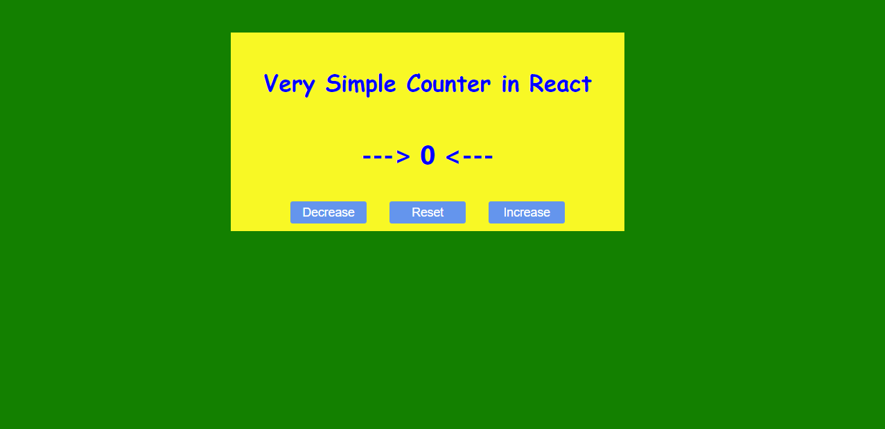

# Simple Counter App React

## Details

This is a simple counter made in React.js. You can increase the counter by one, decrease
the counter by 1 or reset the counter to 0.

Also I added some CSS to make things little nicer and beautiful. I added some inline Style
in JSX conditionally. When the value of counter is greater that zero then the color
of the counter text will be green and when the text is less then zero the color will be
red.

I split the button events so I can learn how it all works. For example I used inline
functions in onclick of button and I also used an external function.

**Live Project Link :** https://counter-app-asad.netlify.app/
